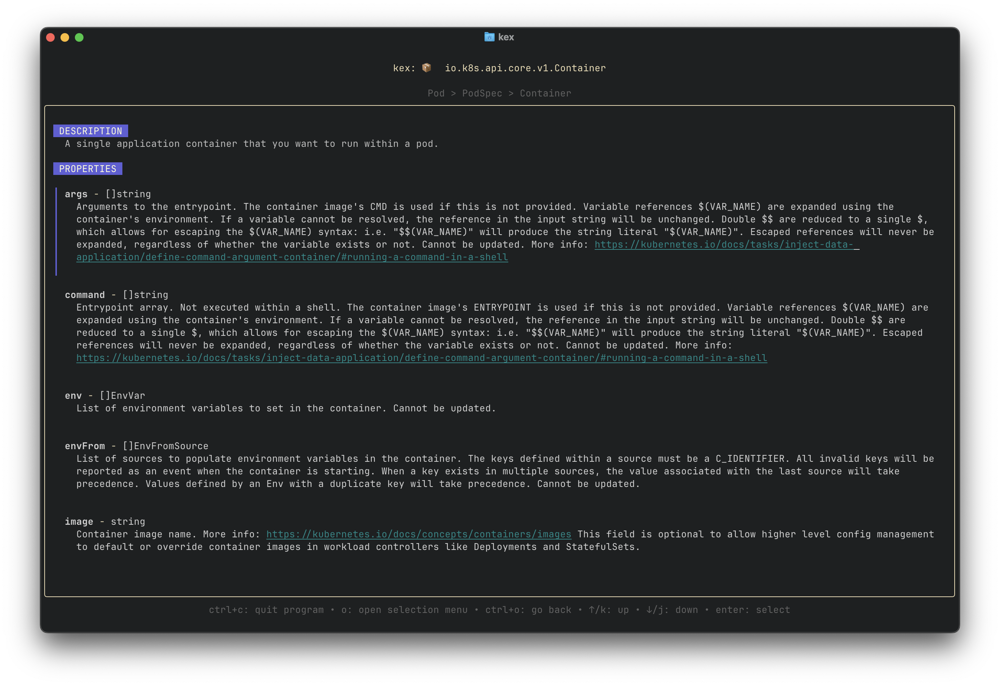

# Kex

Kex: the better kubernetes explain

## Motivation

The goal with kex is to provide a more user-friendly way to navigate the kubernetes specifications.



## How to install

### Building from source
```shell
git clone git@github.com:glsubri/kex.git
cd kex

make install
```
